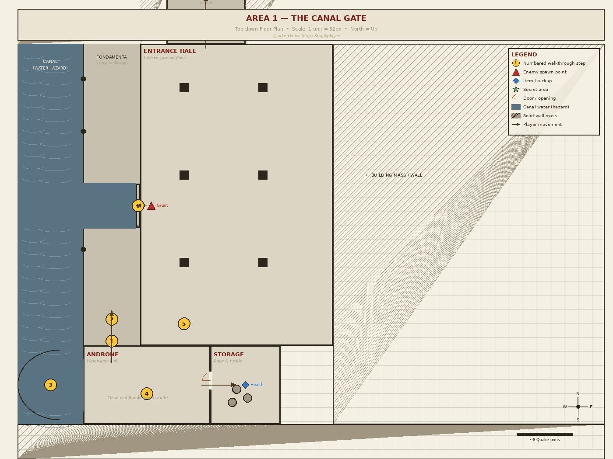
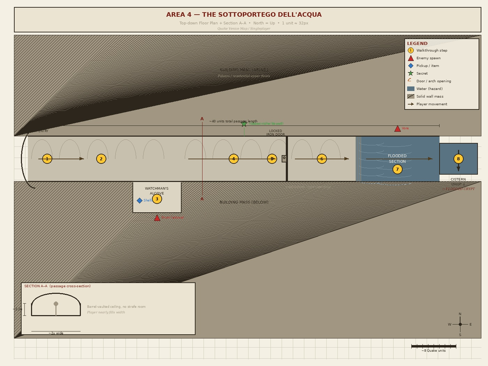

# Topdown Layout and Gameplay Walkthrough

Two areas were selected for detailed top-down floor plans following level design principles from *The Level Design Book*, Max Pears' *Level Design for Combat*, and Tuts+'s beginner layout guide. The layouts were produced digitally and include numbered encounter walkthroughs keyed directly to points on each map.

The areas chosen are the two spatial extremes of the map: **The Canal Gate** is the opening space  exterior, relatively open, low stakes, tutorial-paced. **The Sottoportego dell'Acqua** is the map's tightest and most dangerous space  a one-way linear choke designed around dread and forced commitment. Together they represent the full range of spatial types the map uses.

The floor plans use the following conventions:

| Symbol | Meaning |
|--------|---------|
| **Numbered yellow circle** | Walkthrough step on the map |
| **Red triangle** | Enemy spawn point |
| **Blue diamond** | Item or pickup |
| **Green star** | Secret location |
| **Orange arc** | Door or archway swing |
| **Dark blue fill** | Canal water (damage hazard) |
| **Grey hatching** | Solid wall mass / building |
| **Brown arrow** | Player movement direction |

---

## Area 1  The Canal Gate

The Canal Gate is the map's entry point. The player arrives from the south, moving north through the androne (water-gate hall), across the bridge, and out through the calle toward the campo. The layout is designed to teach two things before the player encounters any combat: the canal water is a hazard, and crossing water via a bridge is the map's primary movement verb.

The space has a short optional loop  the player can enter the storage room off the androne  but the main path is linear and clearly readable. The lone Grunt visible at the far end of the bridge is the first enemy in the map. He is visible well before the player can engage him, which gives time for anticipation to build.

### Walkthrough

**1  Arrive on the fondamenta**
The player spawns at the southern end of the canal-side walkway. The canal is immediately to the left. Mooring posts mark the edge. No enemies. The player can see the bridge ahead and the androne opening below it.

**2  Examine the canal**
Moving north along the fondamenta, the player draws close to the water. Touching it deals slow damage. A short sequence of falling in, taking damage, and climbing the stone steps back up teaches the hazard without punishing the player heavily. The water depth is visible  the bottom is not.

**3  Enter the water gate**
The androne opens to the left. The gate hangs broken on one hinge. The interior is dark compared to the exterior. The canal penetrates the room  a short section of water inside the hall at floor level, navigable by stepping along the raised stone border.

**4  Explore the androne**
The hall is large and empty of enemies. Rope tackle, mooring rings, a rusted iron hook overhead. A door on the east wall leads to the storage room. A stair in the northeast corner leads up. The player can explore freely  this is the map's last fully safe space.

**4a  Storage room (optional)**
The storage room off the androne contains a health pack and a box of shells on a shelf. The door is unlocked. This rewards players who explore before proceeding.

**5  Ascend the stair**
The stair connects the androne to the entrance hall above. This is an elevation change  the player is now at piano nobile level, looking back down at the androne through a grated opening in the floor. The canal is visible far below. This view reinforces the vertical geography of the map.

**6  Cross the bridge**
The bridge is the first real exposure point. A single Grunt stands at the far (north) end. He is visible from the moment the player steps onto the bridge. There is no cover on the bridge  the player must either advance into fire or retreat. The parapet is low; falling into the canal below is possible. This is the first genuine combat decision the player makes.

**7  Exit through the calle**
After the Grunt is down, the calle opening is directly ahead. It is narrow  the buildings press in. A strip of sky above. The passage leads north toward the campo. The map's exploration phase begins here.

---

## Area 4  The Sottoportego dell'Acqua

The Sottoportego dell'Acqua is a single barrel-vaulted passage running approximately 40 units west to east beneath three building masses. The cross-section diagram (Section A–A, shown lower-left on the map) shows the critical spatial constraint: the passage is barely two units wide, with a ceiling just above head height. There is no room to strafe. Every encounter is frontal.

The passage is one-directional. Once the player enters the arch, they cannot return through it  the layout pushes forward. The flooded far section and the cistern drop into the crypt are the point of no return.

The locked iron door partway through the passage cannot be opened from the passage side. It can be heard  sounds from the crypt beyond come through it  but not accessed here. This is an environmental hint that something is below, and that there is a route to it the player hasn't found yet.

### Walkthrough

**1  Enter the arch**
The player approaches the sottoportego entrance from the campo-side calle. A low stone arch. Light behind, darkness ahead. A single oil lamp is mounted just inside the entry, casting light for the first few units. Beyond that, the passage is dim. The player can see perhaps halfway through before the light fails. No enemy is visible from the entry point.

**2  First passage segment**
Moving east, the player passes under the barrel vault. The ceiling is close. The walls are rough undressed stone  no plaster, no decoration. Wires or pipes are visible overhead (vestigial infrastructure). The passage narrows slightly at the midpoint. Every footstep echoes.

**3  Watchman's alcove  Grunt ambush**
The alcove opens in the south wall roughly one third of the way through. A Grunt is stationed inside it, turned away from the passage. When the player passes the alcove mouth, the Grunt pivots and fires. The player has less than one second to react. The alcove is too small to dodge into; the only options are to push forward, retreat, or absorb the hit and fight back in the main passage. A box of shells sits on a stone ledge inside the alcove  visible only after the Grunt is dealt with.

**4  Middle passage segment**
The passage continues east. No enemies in this segment. The lamp at the entry is no longer visible behind. The sound of water becomes audible ahead. The locked iron door is on the north wall here  a heavy banded door with no visible handle on this side. It can be knocked on (incidental world detail). No response.

**5  The locked door**
Stopping at the locked door, the player can hear low sounds through it  the crypt, the water, possibly something moving. The door is set into the wall slightly, creating a small recess  the only cover available in the entire passage. It cannot be opened.

**6  East dry segment**
The passage resumes. The floor begins to show moisture  a dark wet sheen on the flagstone. The ceiling here is at its lowest point. No light source. The player navigates in near-darkness. The sound of water is now loud.

**7  Flooded section  Vore encounter**
The passage opens into the flooded terminal section. Water covers the floor to ankle depth but deals steady damage  the player cannot stop moving. A Vore has positioned itself on a raised stone surface at the far end, above the waterline, visible from the moment the flooded section begins. The Vore begins firing immediately. In the passage width, its projectiles fill almost the entire cross-section. The player must push forward into the Vore's fire while taking water damage from below. There is no safe position. The only viable play is to rush forward and engage at close range, accepting hits, or to strafe in the minimal available space while firing back. A secret niche is set into the north wall of the flooded section  a carved alcove containing a Quad Damage, accessible only by pushing through the water to reach it.

**8  Cistern drop**
With the Vore down, the cistern opening is visible at the east end of the flooded section  a square stone shaft dropping into darkness. The player drops in. There is no return. The path behind closes off. The Flooded Crypt begins below.
